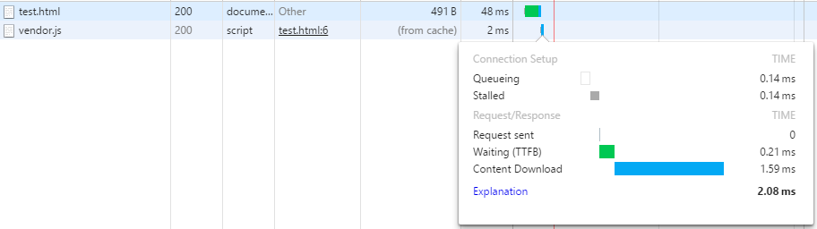

## 浏览器缓存&HTTP缓存

第一次模拟4G网络下的页面加载(禁用缓存)

第二次模拟4G网络下的页面加载

### 浏览器缓存机制--HTTP协议
#### 第一次请求头

#### 第二次请求头

##
	请求头
		Cache-Control: no-cache
		Pragma: no-cache

##
	响应头
		Cache-Controller: max-age=3600
		ETag:"581ad8e7-464dd"
		Date:Sun, 06 Nov 2016 07:22:22 GMT
		Expires:Sun, 06 Nov 2016 08:22:22 GMT
		Last-Modified:Thu, 03 Nov 2016 06:27:51 GMT

##### Expires(HTTP1.0,强缓存,要求客户端和服务器端的时钟严格同步)
Expires存储的是一个用来控制缓存失效的日期。当浏览器看到响应中有一个Expires头时，它会和相应的组件一起保存到其缓存中，只要组件没有过期，浏览器就会使用缓存版本而不会进行任何的HTTP请求。
nginx: expires 1h;

###### 通过引入JS来证明强缓存

##### Cache-Control(HTTP1.1)
max-age=xxx   在 xxx 秒后，浏览器重新发送请求到服务器
Cache-Control是关于浏览器缓存的最重要的设置，因为它覆盖其他设置，比如 Expires 和 Last-Modified
nginx: add_header Cache-Control public; 

Cache-Control 其他指令

##### ETag (协商缓存)
	被请求实体标识。请求时会带上If-None-Match 来判断服务器的文件是否进行了修改是否需要进行内容传输。分布式文件服务器的时候不同服务器的etag不一致
	nginx: etag off;  
##### Pragma(HTTP1.0)
	等同于 Cache-Control: no-cache

##### Last-Modified (协商缓存)
	服务器上文件的最后修改时间。请求时会带上If-Modified-Since 来判断服务器的文件是否进行了修改是否需要进行内容传输。一秒内进行多次修改

##### 判断流程

浏览器行为对缓存的影响(测试强缓存的时候注意)
1）当ctrl+f5强制刷新网页时，直接从服务器加载，跳过强缓存和协商缓存；
2）当f5刷新网页时，跳过强缓存，但是会检查协商缓存；

##### 网站配置强缓存后加载

### 浏览器缓存机制--Meta标签
##
	<meta http-equiv="pragma" content="no-cache" /> <!--定义页面能否缓存-->
	<meta http-equiv="expires" content="Sunday 26 October 2008 01:00 GMT" /> <!--网页的过期时间-->

参考
http://blog.csdn.net/eroswang/article/details/8302191
http://web.jobbole.com/84888/
https://segmentfault.com/a/1190000004132566
https://my.oschina.net/leejun2005/blog/369148