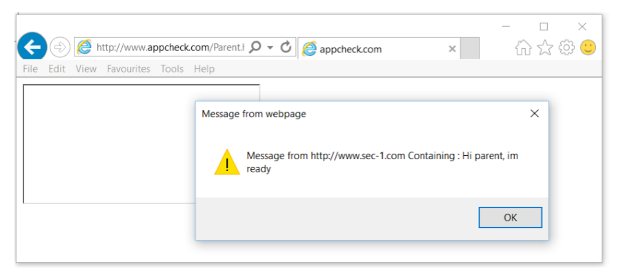

https://www.exploit-db.com/docs/40287.pdf
## 捕捉postMessage漏洞

### 目录
- 1 介绍
	- 1.1 关于SEC-1有限公司
	- 1.2 关于Appcheck
	- 1.3 跨域通信
		- 1.3.1 同源策略
		- 1.3.2 跨域通信的需求
- 2 Window.postMessage
	- 2.1.1 postMessage 例子
	- 2.1.1 发送消息
- 3 postMessage安全
	- 3.1.1 posMessage 跨站脚本(xss)
	- 3.1.5 发送者安全
- 4 postMessage 漏洞例子
	- 4.1.1 漏洞
- 5 寻找postmessage漏洞
	- 5.1.1 PMHook
	- 5.1.2 安装PMHook
- 6 使用PMHook
	- 6.1.1 Message Event Handler 日志
	- 6.1.2 Message Replay and Fuzzing
	- 6.1.3 Addtional Notes
	- 6.2 开始:一个简单的应用
- 7 不完整的验证
	- 7.1.1 不完整的正则验证
	- 7.1.4 不完整的indexOf验证
- 8 案例学习1：Apple Icloud
	- 8.1.1 技术分析
	- 8.1.2 缺陷利用
	- 8.1.3 利用例子
	- 8.1.4 向量确认
- 9 案例学习2: Youtube.com
	- 9.1.1 辨认Message Handlers
	- 9.1.2 代码审查
	- 9.1.3 概念验证
	- 9.1.4 向量确认
- 10 案例学习3:Adobe Marketing Cloud
	- 10.1.1 发现
	- 10.1.2 技术分析
	- 10.1.3 概念验证

### 1.介绍
Sec-1 Ltd 与 AppCheck.com 合作去担任(undertake)一个研究项目下一代网页应用带来的安全挑战.这个项目包含同源通信机制的调查通过HTML，包含postMessage和CORS.

研究中的一个重要发现显示了不安全的postMessage实现漏洞经常被安全扫描器错过并且需要专家进行手动回顾

结果摘要：
	- 跨域通信通过postMessage如果引入了一个被感染的(tainted)数据源是非常难去被现在的工具识别。
	- 跨站脚本和信息泄露漏洞作为不安全的postMassage代码的结果在Alexa前10和许多财富500强企业的网站上出现。本文包含了3个学习案例。
	- 和开发和信息安全社区的成员讨论表明了本文中被论证(demonstrated)的漏洞知道的非常少。许多情况下postMessage事件不容易被确定为恶意污染数据的潜在来源。
	- 在许多情况下漏洞代码通过第三方库引入，因此可能破坏(undermine)在其它安全应用程序的安全

	
本文的目的是去提供最常见的postMessage安全缺陷(flaws)的概述和介绍一个方法和工具集去快速识别漏洞在黑盒审计的过程中。

#### 1.1 关于SEC-1 有限公司	
Sec-1 有限公司是一个成立(established)于英国的渗透测试公司建立(founded)于2001.它的客户合作多种多样，包括为英国金融时报100和财富500强公司的完成测试任务进一步的信息可以在这里找到 http://www.sec-1.com/

#### 1.2.  关于 APPCHECK
AppCheck 有限公司提供了一个领先的WEB应用和外部基础设施漏洞扫描工具(自动化渗透测试工具)，运行他的使用者自动发现安全漏洞在他们网络中的安全边界内更快，更容易，更准确。进一步的信息可以在这里找到 http://www.appcheck.com

#### 1.3. 跨域通信
现代WEB浏览器采用了一个重要的安全机制叫做同源策略(SOP)作为一个安全边界在加载的不同来源网页中。虽然SOP保留在这是谢天谢地了，但是允许安全和可控的通信在不同应用中的需求不断在增加。

##### 1.3.1. 同源策略
同源策略限制了从一个来源加载的文档或脚本对另一个源的资源如何反应。这是一个关键的机制去隔离潜在的恶意文件(Mozilla, n.d.)

文档(网页)被认为同一个来源如果他们有相同的协议(http或https),端口号，和主机名。

简单来说，一个给定页面内运行的脚本有下列限制;
- 脚本只能发起HTTP请求和处理响应在同源的主机中。
- 脚本只能读取和写入到同源的框架中

这个机制在保护指定应用用户session是非常关键的；没有同源策略一个恶意的网站能加载一个敏感的应用(比如网上银行)在一个框架或一个窗口并且对已经加载的应用取得完全的控制去读取数据或进行操作代表用户

下表中列出了一些例子与http://www.appcheck.com/比较不同URL的来源.
协议       Port        Hostname
http://    80          www.appcheck.com

被比较URL 									结果					 原因
http://www.appcheck.com/admin/users.html 	同源 			相同协议和主机名
http://www.appcheck.com/cms/edit.php 		同源 			相同协议和主机名
http://www.appcheck.com:81/cms/edit.php 	不同源 			不同端口
https://www.appcheck.com/cms/edit.php 		不同源 			不同协议
http://en.appcheck.com/cms/edit.php 		不同源 			不同主机名
http://appcheck.com/cms/edit.php 			不同源 			不同主机名 (完全匹配)
http://v2.www.appcheck.com/cms/edit.php 	不同源 			不同主机名 (完全匹配)

##### 1.3.2. 跨源通信的需求	
小的单个来源应用通常记录他们的用户状态信息发布一个session当用户第一次访问网站。cookie的作用域当前应用的域名或父域名，通过浏览器被每个后续请求提交。该应用程序然后能够使用该会话cookie来唯一地标识用户提供的功能，如认证和授权。

但是这种机制不太可能改变，它不能随着应用程序的增长和分布而扩展.大型集成应用（例如由Google提供的那些应用）通过不同URL来提供了的各种服务. (比如 webmail 通过 https://mail.google.com 视频共享通过https://youtube.com/). Cookies 由mail.google.com设置的不能被youtube.com访问由于同源策略. 因此为了提供一个没有缝隙(seamless)的用户体验,应用通常实现跨域通讯去实现信息的共享.越来越多小的应用程序也采用跨源通信技术来交互社交网站，如Facebook，Twitter和Linkedin（所有这些都实现HTML5 postMessage）.

在引入HTML5 postMessage和跨源资源共享（CORS）之前，采用了许多方案来解决同源策略。 一些常见的模式包括：

**重定向和隐藏的IFRAMES**
一个常见分享认证令牌的模式是通过重定向，或加载一个iframe到接收域并携带令牌在URL的HASH部分。

例如，来源A的应用可以通过使用在IFRAME对的URL内嵌入认证令牌创建隐藏的IFRAME到源B来共享用户认证令牌。 加载IFRAME然后可以通过JavaScript（location.hash）访问令牌。  

许多OAuth认证系统实现类似的模式，通常使用一系列重定向在认证服务和需要认证的应用之间。 例如，当对支持Facebook认证的应用进行认证时，用户被定向到Facebook.com以认证和同意访问许可。 然后，Facebook应用创建访问令牌，该访问令牌由重定向URL的散列部分被传递回请求认证的应用。

**跨域POST**
另一个常见的脚本是包含要传送的数据使用一个HTML表单体骄傲数据到接收应用。例如，考虑到访问令牌需要设置为另一个域中的Cookie，可以实现的一种方式是加载自动提交表单，该自动提交表单使用POST请求将访问令牌提交到接受域，然后设置为Cookie。

A域应用提交了一个私密令牌到yourapp.com:

## 
	POST /setcookie HTTP/1.1 Host: yourapp.com  
	secret_token=aaaabbbb 

yourapp.com 设置这个COOKIE在自己的域下
## 
	HTTP/1.1 200 OK … 
	Set-Cookie: secret_cookie=aaabbb

在上述每个示例中，操作通常是单向的，执行双向通信可能变得麻烦。 例如，使用加载的IFRAME的URI嵌入数据允许接收应用程序接收数据，但是没有简单的方式进行通信。 每种所描述的方法还面临着许多安全挑战，例如验证POST请求的起源和通过Open Redirection漏洞防止OAuth利用。

这些解决方法可能会影响用户体验，性能和应用程序的安全性的原因有很多。 为了解决这个问题，引入了window.postMessage来提供跨域文档之间的通信方法。

####2. WINDOW.POSTMESSAGE
window.postMessage 方法通过提供一个受控制的通信方法在不同源的window间来解决跨域问题。

简单地说,window.postMessage允许一个对象化或字符串通过JAVASCRIPT被发送到另一个窗口或frame.接收的窗口可以忽略消息或处理它通过开发者定义的函数。虽然没有安全验证在消息出站的时候，但是消息入站的事件镇南关包含一个origin属性用来验证发送域.

要使用postMessage，接收方要定义一个函数来处理消息，然后使用内置的addEventListener函数将其添加为消息处理程序。

发送方取得一个目标窗口的引用然后调用PostMessage方法去发送消息。

##### 2.1.1 POSTMESSAGE例子
在这个简短的代码例子例子中,父页面托管在http://appcheck/parent.html并且注册一个时间监听函数去处理接收到的消息。也main内嵌了一个iframe加载http://sec-1.com/child.html 用来发送消息给他的上级。

##### 2.1.1.1 发送消息
去发送消息，发送页面必须先取得接受窗口的一个引用然后再调用otherWindow.postMessage 方法传递消息和目标域
postMessasge方法格式:
##
	otherWindow.postMessage(message, targetOrigin, [transfer]) 

otherWindow :其他窗口的引用
Message:发送到另外个窗口的对象或字符串
targetOrigin:消息的目标 
			  协议，主机名和端口在这个参数中提供的要与事件派发的对象一致
			  或者一个通配符* 也能使用
transfer:与消息一起传输的可传输对象序列。

举例，下面的JAVASCRIPT代码可以用来提交一个消息到 https://www.google.com

下表列出了将消息提交到另一个窗口的更多示例
例子									说明
parent.postMessage() 					iframe可以和他的父级通信通过parent引用
iframe.contentWindow.postMessage() 		当和页面中子元素iframe通信时使用iframe.contentWindow   例子
##
	<iframe id="ifrm" src="http://other">
	

window.opener.postMessage() 			一个通过window.open打开的可以通过window.opener.postMessage来提交回消息到上级页面
event.source.postMessage() 				在处理了消息后接收页面可以提交一个消息会发送者通过event.source.postMessage()

在我们的例子中内嵌的iframe提交消息到上级通过下面的JS代码
##
	

加载父页面会产生以下结果;

##### 2.1.1.2 接受和处理消息事件
下面的代码内嵌到parent.html并且注册postMessage事件处理者去显示和弹出收到的消息。
##
	 